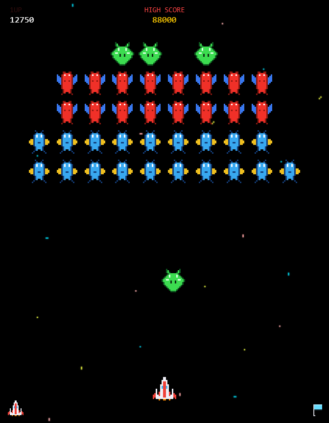
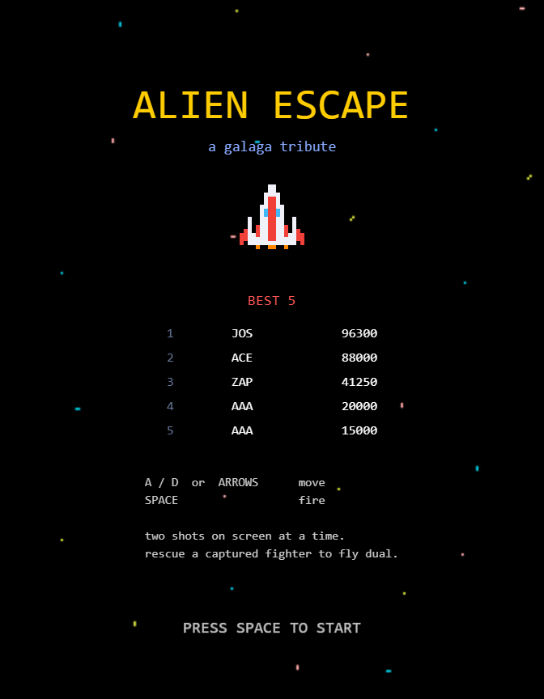
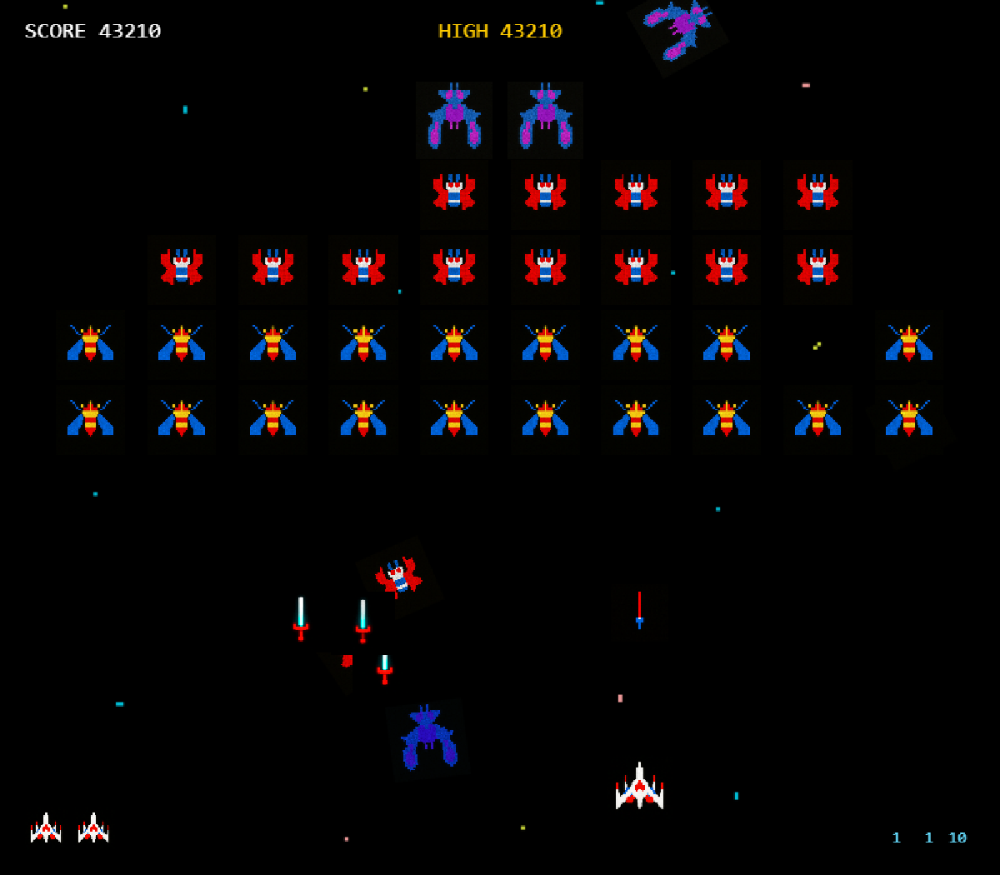
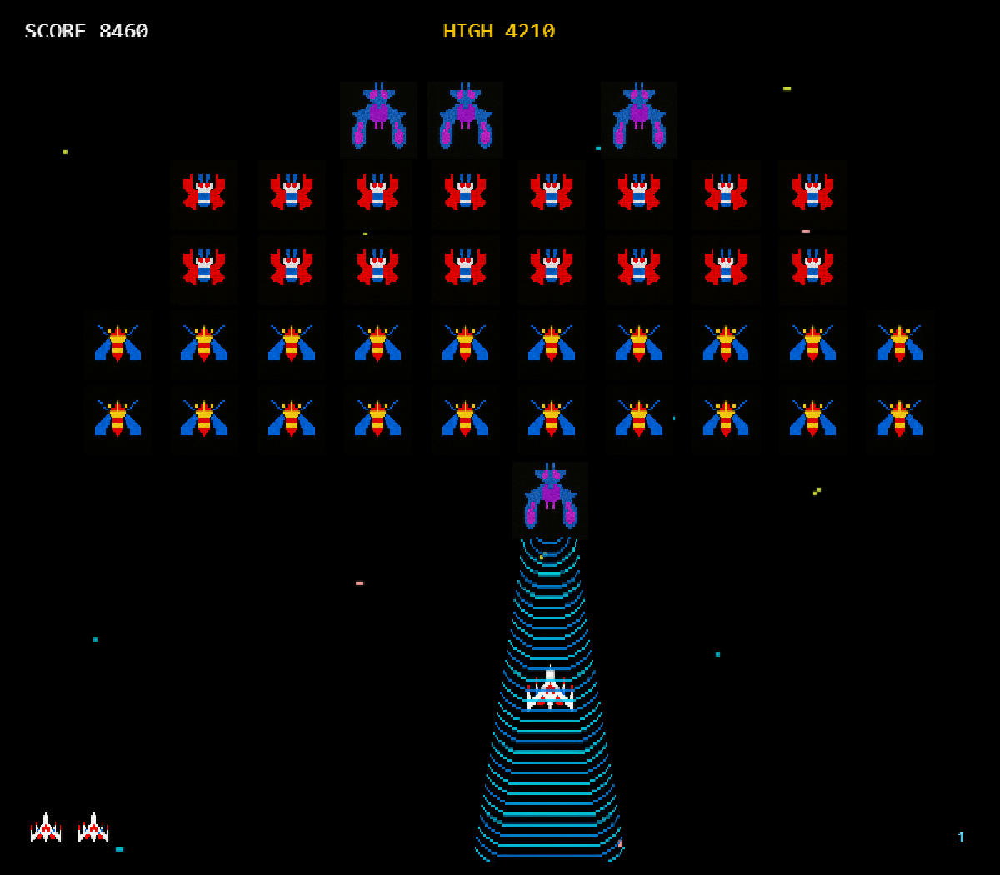
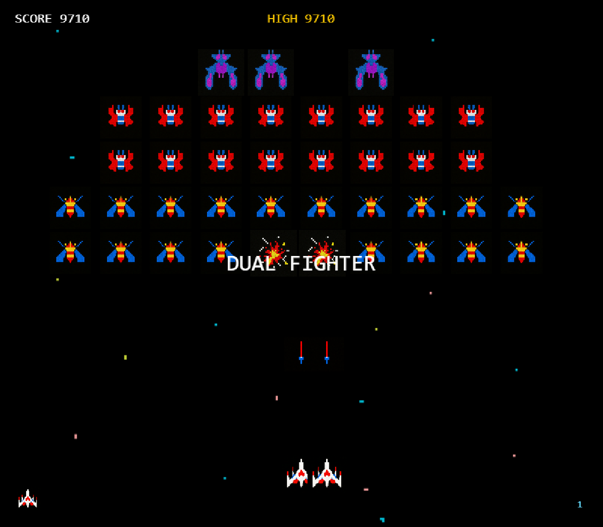
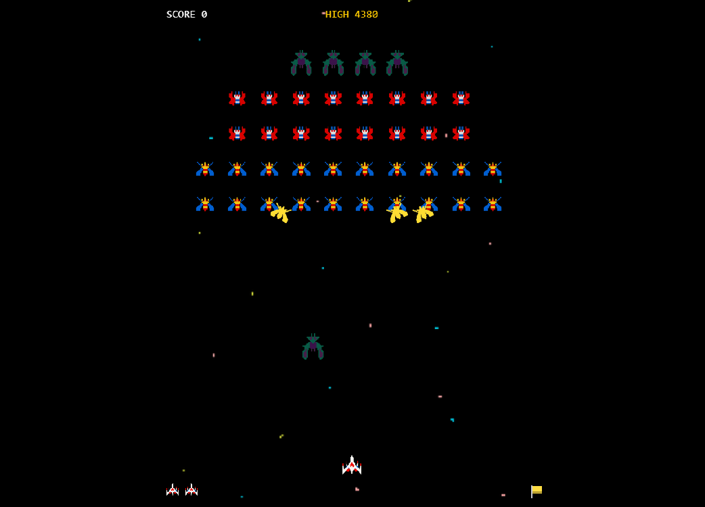
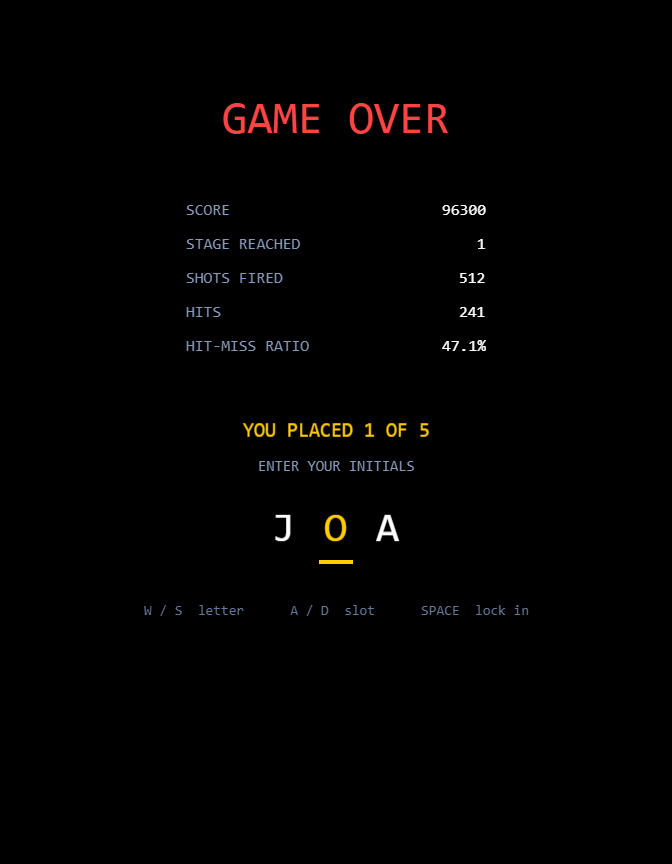
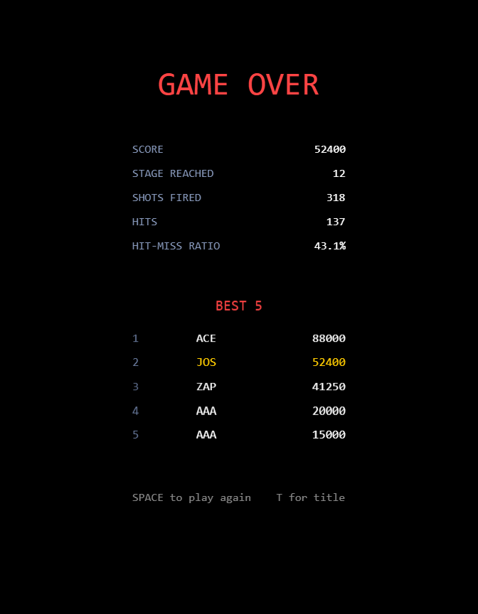
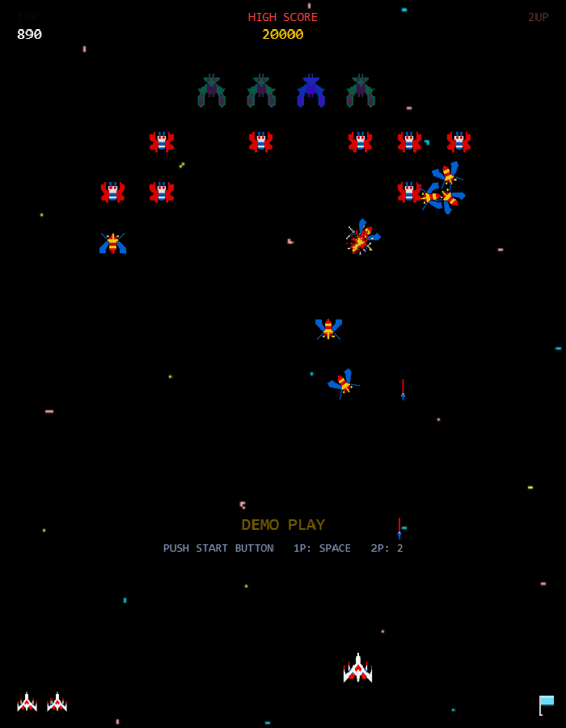
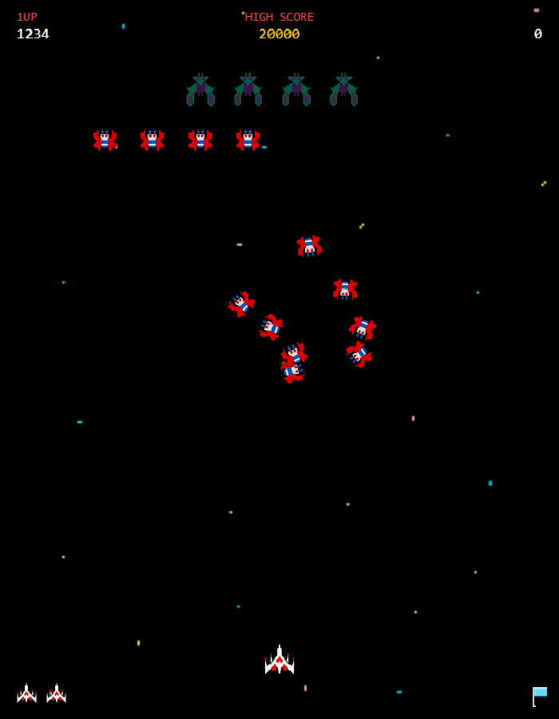

# Alien Escape - a Galaga replica

A Galaga replica where the game rules live in pure, dependency-free ES modules that never import Phaser, so they can be unit tested headlessly. The Phaser scenes are thin orchestration over that logic.

> **Unofficial fan tribute.** Not affiliated with, endorsed by, or sponsored by Bandai Namco Entertainment Inc. *Galaga* is their trademark, used here only to describe what this project reimplements.

## [Play it in your browser](https://jdardash.github.io/alien-escape/)

[](https://github.com/jdardash/alien-escape/actions/workflows/ci.yml)
[](tests/)
[](LICENSE)
[](index.html)



---

## Why this repo is structured the way it is

Arcade game code has a well-known failure mode: the rules of the game get tangled into the rendering framework, and then nothing can be tested without spinning up a browser. The original version of this project had that shape, with 867 lines of gameplay logic living inside a single Phaser scene.

The rewrite draws one boundary and enforces it:

> **Nothing in `src/systems/` may import Phaser.** Pure functions in, plain values out.

```text
index.html            <script type="module" src="src/main.js">
lib/phaser.js         vendored, loaded as a classic script (no CDN dependency)
src/main.js           Phaser config, scene registration
src/config.js         tuning constants in one place
src/systems/          PURE. No Phaser import. Fully unit tested.
  formation.js        40-slot grid, breathing, sway, entry flights
  caravans.js         the 13 entrance rows, in the arcade's own path-byte encoding
  paths.js            Bezier entry, dive, return and challenging-stage paths
  flight.js           frame-rate-independent traversal of a path
  scoring.js          score tables, extra-life thresholds
  stages.js           stage progression, difficulty rank, transform cycle, rollover
  capture.js          tractor beam capture and rescue state machine
  players.js          two-player alternating turns: whose ship, whose score
  demo.js             the pilot that flies the attract screen
  persistence.js      BEST 5 board, high score and difficulty rank via injected storage
  stats.js            shots, hits, hit-miss ratio
  audio.js            which sound plays when
src/art/              PURE. Every ship, drawn as a 16 x 16 pixel grid.
  pixelArt.js         the grids and palettes, plus a strict parser
  textures.js         the one seam that turns a grid into a Phaser texture
  localArt.js         optional local sprite overrides; see docs/local-art.md
src/audio/            PURE. Every sound, synthesised rather than sampled.
  synth.js            waveforms, envelopes, glides, an LFSR for the noise
  soundBank.js        the spec for all 28 sounds, and the one Phaser seam
  localAudio.js       optional local sound overrides; see docs/local-audio.md
src/entities/         sprite construction helpers
src/scenes/           Phaser-aware. Thin orchestration.
  TitleScene.js  GameScene.js  GameOverScene.js
tests/                vitest, headless, no canvas
```

Why it pays off:

- **The tests need no canvas, no DOM, no browser.** `vitest run` finishes the whole suite in about a second because there is nothing to boot.
- **No mocks.** A test for the scoring table calls `scoreFor()` with plain arguments. A test for the capture cycle drives a state machine with plain event strings. There is no fake scene to construct and no test double to keep in sync with a real implementation.
- **The rules are readable on their own.** Whether a Challenging Stage lands on stage 7 is answered by one function in `src/systems/stages.js`, not by tracing a scene's `update()`.
- **CI is trivial.** Lint and test, node only, no headless browser in the workflow. See [.github/workflows/ci.yml](.github/workflows/ci.yml).

The scenes still do real work, but it is orchestration: create sprites, read input, register collisions, and ask the systems layer what should happen. A deeper walkthrough of the frame flow, the formation math, and the Bezier path generation is in [docs/ARCHITECTURE.md](docs/ARCHITECTURE.md).

## Galaga mechanics implemented

- **40-slot formation**: 4 Boss Galaga, 16 Goei, 20 Zako across five rows of a 10-column grid
- **Entrance patterns fixed per stage**, each flown as five flights of eight, selected on the arcade's own cycle: `combatStageIndex` reproduces the ROM's index arithmetic — seventeen rows, counting combat stages only, wrapping past stage 23 by four. Three shapes are authored where the cabinet stores thirteen, so the *schedule* is authentic and the full shape vocabulary is not. One of the three is the arcade's both-sides entrance, which pairs its arrivals two to a step while the other two stay single file
- **Formation breathing and sway**: the grid expands and contracts horizontally while drifting, clamped so the outermost column never leaves the screen
- **Dive attacks**: enemies peel out of formation along curved runs aimed at the player, exit through the bottom, and re-enter from the top back into their slot. Nothing ever fires from inside the formation, no more than eight enemy shots exist at once, and stage 1 does not bomb at all — the arcade's opening difficulty row has its bomb flags at zero, so the first screen can only kill you by flying into you
- **Tractor beam capture**: a Boss Galaga breaks formation, descends into your half of the field *aiming at your column*, opens a beam, and pulls the fighter in; you lose a life but the ship is held above its captor. Captures are gated the way the arcade gates them — never on stage 1, never during a bonus round, and never once the formation is down to a handful
- **A captive that fights back**: the held ship bombs you on its captor's dive, and if you shoot that captor while it is still in formation the ship breaks loose, swoops at your column, fires once and is gone for good
- **Dual fighter rescue**: destroy the captor *while it is diving* and the ship docks, giving a double-width fighter with doubled firepower and a four-bullet limit instead of two. The second ship is a real hitbox, so the upgrade is paid for
- **Boss Galaga takes two hits**, turning from green to blue on the first
- **Challenging Stages** on stage 3 and every fourth stage after: eight distinct routes, five waves of eight, one rank of enemy plus four Boss Galaga, no firing and no diving, and clearing all forty pays a perfect bonus
- **Transform bonus enemies** from stage 4: a Zako pulsates and becomes a trio of Scorpions, Bosconian Spy Ships or Galaxian Flagships, worth 160 each and 1,000 to 3,000 more for the completed set. They attack on the way past, which is what the points are for
- **Authentic scoring**: a target is worth more diving than in formation, and a diving boss is worth more again depending on how many Goei escort it down
- **Extra lives** at the arcade's factory thresholds (20,000, then 70,000, then every 70,000)
- **Stage flags** in the greedy largest-first denominations the arcade uses, drawn as flags
- **The stage counter rolls over**: the stage after 255 is announced as stage 0, exactly as the arcade's single-byte counter does
- **An attract mode**, not a title screen: the cabinet's own loop of logo, the `-- SCORE --` chart of what every enemy is worth in formation and attacking (including the boss escort tiers), the extra-ship ladder, and the board — over a `CREDIT` line and `PUSH START BUTTON`. Every figure on the chart is read from `scoreFor()` as it is drawn, so it cannot drift from the table it documents
- **A BEST 5 board with initials entry**: a run that makes the top five is asked for three initials, and the board survives a reload
- **Hit-miss ratio** reported at game over, which is what makes the two-bullet limit a scored constraint rather than an annoyance
- **Per-rank audio**: every rank of enemy has its own cry, a boss surviving its first hit sounds different from one dying, and the gun alternates two samples so a burst does not flatten into a tone. All 28 sounds are synthesised at startup from the specs in [src/audio/soundBank.js](src/audio/soundBank.js) — square, triangle and saw voices over a shift-register noise source, which is the palette the cabinet's own Namco WSG had. Nothing is sampled and nothing is downloaded

## Defects found and fixed

These were found by reading the original `GameScene.js` before rewriting it. They are listed because finding them is the part of the work worth showing, not because any of them was hard.

| Defect | Why it mattered | Fix |
| --- | --- | --- |
| `highScore` assigned `0` in `create()` and never persisted | The on-screen HIGH SCORE silently reset on every page reload | `src/systems/persistence.js`, with storage injected so a sandboxed iframe or blocked site data degrades to memory instead of throwing |
| A debug cheat key (`keydown-THREE`, jump to stage 3) shipped to production | Anyone could skip to stage 3 on the live demo | Removed |
| `pullInterval` assigned twice, never read | Dead state that reads as meaningful | Removed |
| `enemyMoveDelay` computed in `spawnWave`, then unconditionally overwritten in `update` | The computed value could never take effect; the intent was unrecoverable from the code | Difficulty is now a single pure function, `stageDifficulty(stage)` |
| Formation bounds used `height / 2` in one place and `height / 3` in two others | Inconsistent bounds for the same conceptual limit | All tuning constants consolidated into `src/config.js` |
| The anti-overlap pass ran O(n^2) with its skip guard inside the inner loop instead of the outer | The guard did not skip the work it was written to skip | Replaced; formation positions are now computed directly from slot geometry, so no overlap pass is needed |
| Per-frame `Math.random() < fireChance` rolls for enemy fire | Tied difficulty to refresh rate: the same stage was roughly twice as hard on a 144Hz display | Fire and bomb release are driven by timers and by fixed points along a path, so behaviour is frame-rate independent |

## Testing

```bash
npm install
npm test        # vitest run  - 424 tests across 17 files
npm run lint    # eslint .
```

Every test targets `src/systems/`. There is no canvas, no jsdom game harness, and no Phaser instance anywhere in the suite.

**Deliberately not tested: Phaser rendering.** Verifying that a sprite drew at the expected pixel needs a browser harness and a screenshot baseline, and it would test Phaser rather than this project. The value is in the rules, so the rules are what is covered. The scenes are kept thin specifically so that the untested surface stays small.

## Run it locally

```bash
git clone https://github.com/jdardash/alien-escape.git
cd alien-escape
npm run serve     # python -m http.server 8000
```

Then open <http://localhost:8000>.

The project is native ESM with no bundler. **Opening `index.html` directly from the filesystem will not work** - browsers block `type="module"` scripts loaded over `file://` under the module CORS rules, and the game will fail to start. It has to be served over HTTP. Any static server will do; `npm run serve` just uses Python's built-in one so there is no extra dependency.

Because there is no build step, GitHub Pages serves the repository root unchanged. What runs locally is byte-for-byte what runs on the live demo.

## Controls

| Input | Action |
| --- | --- |
| `A` / `D` or arrow keys | Move |
| `Space` | Fire |
| `Space` or `1` on the attract screen | Start a one-player game |
| `2` on the attract screen | Start a two-player game, taking turns |
| `R` on the attract screen | Cycle the difficulty rank, A to D |

Leave the attract screen alone for half a minute and the machine plays itself, as the cabinet does. Any start button takes the game off it.

## Screenshots

| | |
| --- | --- |
|  |  |
| Title screen with the BEST 5 board | Formation assembled |
|  |  |
| A boss diving with two Goei escorts | Tractor beam over the fighter |
|  |  |
| Dual fighter, firing two | A trio of Galaxian Flagships |
|  |  |
| Initials entry for a top-five run | Results with hit-miss ratio |
|  |  |
| The attract screen playing itself | Two players alternating, both columns live |

## Built with

| Technology | Role |
| --- | --- |
| Phaser 3 | Scene graph, arcade physics, input, audio. Vendored in `lib/`, not loaded from a CDN |
| JavaScript (ES2022 modules) | Game rules, all of it in `src/systems/` |
| vitest | Headless unit tests |
| ESLint 9 (flat config) | Linting, run in CI |
| GitHub Actions | Lint and test on push and pull request |
| GitHub Pages | Static hosting, serving the repo root with no build |

## Contributors

- [Josh Dardashti](https://github.com/jdardash)
- [Charles Li](https://github.com/Charlesli428)

## License

The code in this repository is MIT licensed - see [LICENSE](LICENSE).

Phaser 3, vendored in `lib/`, ships under its own MIT license and its own copyright.

**The ship artwork is original.** Every fighter, enemy, bonus ship and stage flag is a hand-authored pixel grid in [src/art/pixelArt.js](src/art/pixelArt.js), drawn to the published descriptions of each ship rather than traced from the ROM, and generated as a texture at run time. It is MIT along with the rest of the code. The Galaga-derived enemy PNGs this replaced have been deleted from the working tree, though they remain in this repository's git history.

**The audio is original too.** All 28 sounds are synthesised at run time from the specs in [src/audio/soundBank.js](src/audio/soundBank.js). The effects are arithmetic; the four melodic pieces — the attract theme, the two end-of-game tunes and the rescue fanfare — are written for this game rather than transcribed from Galaga's, whose compositions are as much Bandai Namco's as its sprites are. This replaced 28 mp3s ripped from the ROM, which were committed here and served from the public demo. They have been removed from the working tree and remain only in git history. [tests/audio.test.js](tests/audio.test.js) reads `git ls-files` and fails if any audio file is ever committed again.

A local checkout can substitute the cabinet's own sprites and samples through a gitignored `assets/local/` directory — see [docs/local-art.md](docs/local-art.md) and [docs/local-audio.md](docs/local-audio.md). Nothing put there can reach this repository, the demo, or a pull request, and the title screen labels any run that is using it.

Naming this a replica, a tribute or a clone is not a licence for any of the above, which is why none of it is copied. **What is copied is the design**: the rules, the timings, the formation shapes and the scoring tables, none of which copyright covers. What remains loaded from disk is the starfield, the two projectiles, the explosion and the tractor beam, which are Galaga-derived, used here for a non-commercial tribute, the property of their respective owners, and not covered by this repository's license.

**Trademark.** *Galaga* and *Bandai Namco* are trademarks of Bandai Namco Entertainment Inc. This project is not affiliated with, endorsed by, or sponsored by them. The name is used descriptively, to identify the arcade game this repository reimplements, and the project ships under its own distinct name. No official assets, logos or branding are claimed.
