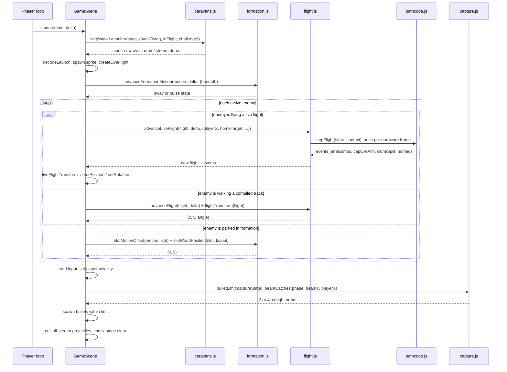
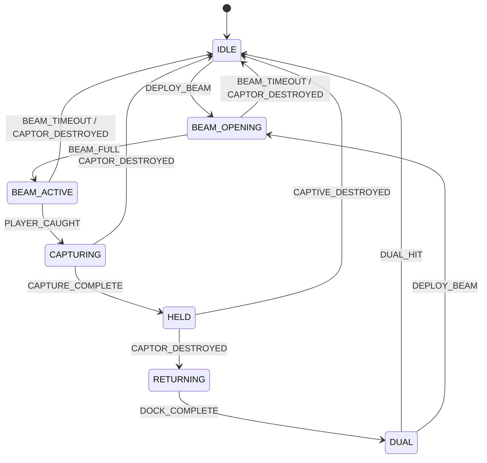

# Architecture

A technical companion to the [README](../README.md). This covers the module boundary and why it is drawn where it is, how a single frame flows through the codebase, how the formation and the caravan machine work, how the path bytecode interpreter runs the ROM's own byte tables, and what the testing strategy covers and deliberately does not.

## The layering

The pure layer now splits into **machine modules** (interpreters and schedulers ported from the ROM's routines) and **data modules** (the ROM's byte tables, transcribed verbatim and tested byte for byte). `GameScene` imports nearly every machine module, so the diagram draws one edge into the layer rather than twenty-three.

```mermaid
graph TD
    subgraph browser["Browser"]
        HTML["index.html<br/>classic script: lib/phaser.js<br/>module script: src/main.js"]
    end

    subgraph phaser["Phaser-aware layer"]
        MAIN["src/main.js<br/>game config, scene registration"]
        TITLE["TitleScene"]
        GAME["GameScene<br/>sprites, input, collisions, timers"]
        OVER["GameOverScene"]
        SVC["ServiceScene<br/>DIP switches, volume pot, scanlines"]
        ENT["src/entities/enemy.js<br/>sprite construction"]
    end

    subgraph pure["Pure layer - no Phaser import"]
        CFG["src/config.js<br/>tuning constants"]
        PATHCODE["pathcode.js<br/>the f_08D3 flight interpreter"]
        FLDATA["flightData.js<br/>fly-in blocks, attack tables"]
        PATHS["paths.js<br/>compiled tracks + live states"]
        FLIGHT["flight.js<br/>track walker + live flights"]
        CARAVAN["caravans.js<br/>c_25A2 compile, f_2916 launcher"]
        CARDATA["caravanData.js<br/>d_combat_stg_dat, wave IDs"]
        FORM["formation.js<br/>slots + the two-phase grid motion"]
        DIFF["difficulty.js<br/>c_2C00 decode, f_0857 reloads"]
        DIFFDATA["difficultyData.js<br/>bmbr_stg_cfg_dat + reload tables"]
        ATTACK["attack.js<br/>the f_1B65 scheduler, bombs, no-fire"]
        CAP["capture.js<br/>beam, pull, rescue machine"]
        BEAM["beam.js<br/>beam strip geometry"]
        ANIM["animation.js<br/>flap and rotation clock"]
        STARS["starfield.js<br/>the 05XX star chip"]
        STARDATA["starData.js<br/>MAME's 252-star capture"]
        SCORE["scoring.js"]
        STAGE["stages.js"]
        PLAY["players.js<br/>two-player turns"]
        DIPS["dips.js<br/>the operator's switches"]
        SETTINGS["settings.js<br/>volume pot, scanlines"]
        CONTROLS["controls.js<br/>pad and touch shapes"]
        DEMO["demo.js<br/>the attract pilot"]
        PERS["persistence.js"]
        STATS["stats.js"]
        AUDIO["audio.js<br/>which sound plays when"]
        ART["art/pixelArt.js + font.js<br/>every ship and glyph, as a pixel grid"]
        SYNTH["audio/synth.js + soundBank.js<br/>every sound, as a spec"]
    end

    subgraph tests["tests/ - vitest, headless"]
        T["30 test files, 745 tests"]
    end

    HTML --> MAIN
    MAIN --> TITLE
    MAIN --> GAME
    MAIN --> OVER
    MAIN --> SVC
    GAME --> ENT
    GAME --> pure
    TITLE --> PERS
    TITLE --> SYNTH
    TITLE --> STARS
    TITLE --> DIPS
    SVC --> DIPS
    SVC --> SETTINGS
    SVC --> PERS
    OVER --> STATS
    OVER --> PERS

    PATHS --> PATHCODE
    PATHS --> FLDATA
    FLIGHT --> PATHS
    FLIGHT --> PATHCODE
    CARAVAN --> CARDATA
    CARAVAN --> DIFFDATA
    CARDATA --> FLDATA
    CARDATA --> DIFFDATA
    FORM --> CARAVAN
    FORM --> CARDATA
    FORM --> PATHCODE
    DIFF --> DIFFDATA
    DIFF --> CARAVAN
    ATTACK --> DIFF
    ATTACK --> DIFFDATA
    ATTACK --> PATHCODE
    CAP --> PATHCODE
    STARS --> STARDATA
    STARS --> PATHCODE
    STAGE --> PATHS
    STAGE --> FORM
    STAGE --> CARAVAN
    STAGE --> DIFF
    SCORE --> FORM
    SCORE --> STAGE
    AUDIO --> SYNTH
    AUDIO --> FORM
    DIPS --> CARAVAN
    PERS --> CARAVAN
    PLAY --> STATS
    ANIM --> CFG

    style pure fill:#eef7ee,stroke:#4a7c4a
    style phaser fill:#eef1f7,stroke:#4a5c7c
    style tests fill:#f7f3ea,stroke:#7c6a4a
```



The arrows only ever point downward out of the Phaser layer. Nothing in the pure layer reaches back up. The dependency edges shared with `pathcode.js` are mostly one constant, `FRAME_MS` -- every machine in the layer counts time in the cabinet's 60.606 Hz hardware frames, and they all take that number from one place.

## The boundary rule

**No module under `src/systems/` may import Phaser, touch the DOM, read a global, or mutate anything it was handed.**

The rule is one line, and it is checkable in one command:

```bash
grep -r "Phaser\|phaser" src/systems/
```

The only hits are the word "Phaser" inside five comments -- in `demo.js`, `players.js`, `controls.js`, `audio.js` and `formation.js` -- each explaining why that module exists without it.

### What the rule buys

The obvious payoff is testability, but that is a consequence rather than the point. The real property is that **the rules of the game have a definition that is independent of how they are drawn.** Three things follow:

1. **Tests need no harness.** No canvas, no jsdom game instance, no headless Chromium in CI. The workflow is `npm ci && npm run lint && npm test` on plain Node.
2. **Tests need no mocks.** This is the part that usually erodes. When logic lives inside a framework object, testing it means constructing a fake version of that object, and the fake drifts from the real one until the tests assert things about the fake. Here `scoreFor('boss', { diving: true, escorts: 2 })` takes plain values and returns a number. There is nothing to fake.
3. **The untested surface is small and deliberately boring.** Everything left in the scenes is sprite creation, collision registration, timer scheduling, and HUD text. That code is not tested, so it is kept to a shape where a reader can verify it by eye.

### Where dependencies are injected instead of imported

`persistence.js` is the clearest example. It never references `localStorage`; the storage object is a parameter.

```js
loadHighScore(storage, key)
saveHighScore(storage, score, key)
```

This started as a testability concern and turned out to matter in production. `localStorage` access throws outright in a sandboxed iframe or with site data blocked. `resolveStorage()` probes with a real write round trip rather than checking for the object's presence, because Safari in private mode historically exposed the object and threw on write. If the probe fails, the game gets an in-memory shim and quietly forgets the score instead of white-screening.

### Immutability in the hot path

The pure modules return new objects rather than mutating their arguments, including in code that runs every frame:

```js
export function advanceFlight(flight, deltaMs) {
  const elapsedMs = Math.min(flight.elapsedMs + Math.max(deltaMs, 0), flight.durationMs);
  return { ...flight, elapsedMs };
}
```

Forty small object allocations per frame is not a cost worth optimising against at this scale, and the return-a-new-value shape is what makes a test able to assert on a sequence of states rather than on a single mutated one. The one deliberate exception is the interpreter's inner loop: `stepFlight` mutates the flight state it is given, because it runs up to twelve flights times several hardware frames per render frame -- so `flight.js` clones the state once per advance and the exception never leaks past the module boundary.

## How a frame flows

`GameScene.update(_time, delta)` is deliberately short. It advances the starfield and then delegates:

```js
update(_time, delta) {
  if (this.isGameOver || this.frozen) return;

  this.updateStarfield(delta);
  this.formationElapsed += delta;

  this.updateWaveLauncher(delta); // walk the caravan byte stream; see caravans.js
  this.updateFormation(delta);
  this.updateAttacks(delta);      // the f_1B65 scheduler; see attack.js
  this.updateDiveSound();
  this.updatePlayer();
  this.updatePull(delta);         // the tractor pull, one hardware frame at a time
  this.updateCaptive(delta);
  this.updateBeam(delta);
  this.cullProjectiles();
  this.checkStageComplete();
}
```



Three properties are worth calling out.

**Parked positions are derived, not accumulated.** An enemy sitting in formation has its position recomputed from its slot every frame: `slotWorldPosition(slot, layout)` plus this frame's `slotMotionOffset(...)`. Nothing integrates a velocity for a parked ship, so forty sprites cannot desynchronise from each other. Flights do integrate -- the ROM's machine is an integrator -- but in 16-bit fixed point over whole hardware frames, so the same flight always traces the same pixels regardless of how the render deltas arrive.

**Time is hardware frames, never per-frame probability.** Every machine -- the wave launcher, the formation motion, the attack scheduler, live flights, the tractor pull -- runs whole 60.606 Hz frames out of a millisecond accumulator. Nothing rolls `Math.random() < chance` per render frame, which is the pattern an earlier revision had and which tied difficulty to display refresh rate: the same stage was roughly twice as hard at 144 Hz as at 60 Hz. Now a 144 Hz monitor and a 60 Hz monitor step the same machines through the same frames.

**Collisions are the one place the scene owns a rule.** `registerCollisions()` holds the guard that makes Challenging Stages safe:

```js
this.physics.add.overlap(this.player, this.enemies, (_player, enemy) => {
  if (this.challenging) return;
  ...
});
```

The arcade's bonus round routes enemies straight through the player's lane. Without this guard the bonus round would be the most lethal part of the game. It lives in the scene because it is a property of the Phaser collision registration rather than of the rules themselves.

## Formation and the caravan

Galaga assembles exactly 40 enemies into a 10-column grid.

| Row | Type | Columns occupied | Count |
| --- | --- | --- | --- |
| 0 | Boss Galaga | 3-6 | 4 |
| 1 | Goei | 1-8 | 8 |
| 2 | Goei | 1-8 | 8 |
| 3 | Zako | 0-9 | 10 |
| 4 | Zako | 0-9 | 10 |

Listing the occupied columns per row, rather than a width and an offset, is what keeps the shorter boss and goei rows centred against the full-width zako rows without any per-row arithmetic at the call site. In the ROM the grid is addressed by object ID through `sprt_fmtn_hpos` (gg1-5.s:185-191) -- 48 slots on a 6-row grid, 8 of them phantom -- and `slotIndexForObjectId()` maps those IDs onto these 40 slots; ROM row 0, the rogue/captured-ship row, holds no formation enemy and is not built.

`buildFormationSlots()` returns the 40 slots in **grid space**, not world space:

```js
{ index, row, column, type, gridX: column - centreColumn, gridY: row }
```

`gridX` is offset so the grid centre (column 4.5) maps to 0, which makes world placement a multiply-and-add around a centre point:

```js
x = centreX + gridX * spacingX + offsetX
y = topY   + gridY * spacingY + offsetY
```

`spacingX` is 48 screen px -- the ROM's own 16-px column pitch through the x3 screen adapter -- and `offsetX`/`offsetY` come from the grid's motion machine. That machine is the ROM's, in two mutually exclusive phases (`createFormationMotion` / `stepFormationMotion`):

- **The fly-in sway** (`f_2A90`, gg1-3.s:2007-2035): while the caravan is still arriving, the whole grid shares one X offset -- a triangle wave, 1 px per 4 hardware frames, reversing at +/-32 ROM px. When the wave launcher finishes it raises the handoff flag (`_b_nestlr_inh`) and the sway coasts until it crosses centre, then hands over.
- **The breathing pulse** (`f_1DE6` over `d_1E64_bitmap_tables`, gg1-2_fx.s:1562-1653 and 1721-1726): a phase counter runs 0x00 up to 0x1F, jumps to 0xA0, runs down to 0x81 and wraps. Every fourth frame a working bitmap -- reloaded from the table every 8 ticks -- is rotated per slot, and each carried-out bit steps that slot's offset. The bitmap gates ten **per-column X** offsets and six **per-row Y** offsets: the outer columns (byte 0xFF) sweep a pixel every tick, the inner ones (0x10) barely move, and the phantom row (0x00) never moves. The breathing is absolute pixel offsets, not a scale factor -- the `breathScale` multiplier of earlier revisions is gone, along with the sine functions behind it.

There is no formation-centre clamp in the scene any more: with the ROM's own pitch, the peak pulse spread lands the outermost sprite exactly on the screen edge (`GameScene.slotPosition`). `clampFormationCentre()` survives in `formation.js` for callers on other geometries.

**How the wave arrives.** The ROM never launches enemies from `d_combat_stg_dat` directly, and neither does this codebase. Once per stage, `compileCaravanStream()` (the port of `c_25A2`, gg1-3.s:1168-1423) compiles the stage's 18-byte caravan row -- headers, five waves of `[control, leftyByte, rightyByte]` -- into a flat byte stream: wave markers, then `[pathByte, objectId]` pairs alternating the left and right member of each pair, with the wave's random-slotted transients (the fly-through bees and moths, IDs 0x38-0x3E) interleaved. Wave membership comes from `db_attk_wav_IDs`: wave 1 is the centre Goei and Zako, and **the four bosses arrive in wave 2** with escort Goei -- not first, as an earlier revision's contiguous slot blocks had it.

Every frame, `stepWaveLauncher()` (the port of `f_2916`, gg1-3.s:1658-1745) walks that stream at most one byte forward: a gated path byte fires only on the `frame & 7` beat, its ungated wing-man fires the very next frame, a launch waits when the 12-slot motion queue is full, and on challenge stages a ~1 s timer holds between waves. That walk is where the whole rhythm of a stage opening comes from. Each launched member carries its `db_2A3C` path index, its mirror bit and its formation slot; a diver that survives its run flies home to that same slot.

The lane hazard this design creates is pinned by a test, and the test has a bug behind it. An earlier revision's authored entry paths once routed all forty arriving enemies through the player's row and ended the game during the opening stream before a shot could be fired. The real data is subtler -- the ROM's waves 2 and 3 genuinely enter from the bottom of the screen -- so the invariant adapted rather than died: `keeps combat fly-ins out of the central band of the player lane` in `tests/paths.test.js` checks every combat block on both sides against the centre of the player's row.

## The path bytecode interpreter

Galaga flies every enemy with one Z80 routine, `f_08D3` (gg1-5.s:1422-2340), and `src/systems/pathcode.js` is a port of that machine: same fetch order, same motion arithmetic, same token semantics, working in the ROM's own 224 x 288 coordinate space. The byte tables it runs -- the 22 fly-in blocks behind the 24-entry `db_2A3C` index, the `db_2A6C` spawn variants, the three attack-dive tables, the capture, rogue and carry-home paths, the bonus-bee convoy streams -- are transcribed verbatim in `flightData.js`. The heading-delta encoding this doc used to describe (256 units per circle, `[turn, frames]` pairs) was an intermediate invention and is gone.

A flight state holds a 16-bit fixed-point position per axis, a 10-bit angle (1024 units per circle), per-axis speed nibbles, a rotation rate and a program counter. A segment timer counts down; when it expires the next byte is fetched. Below 0xEF it opens a **3-byte segment** -- `[(vy << 4) | vx, signed rotRate, duration]` -- and each frame thereafter adds `rotRate` to the angle and moves. At or above 0xEF it dispatches a control token:

| Byte | ROM case | What it does |
| --- | --- | --- |
| FF | `case_0E49` | End: deactivate where it stands |
| FE | `case_0B16` | Turn-hold: pick the segment duration from an 8-byte LUT by where the player stands |
| FD | `case_0B46` | Jump |
| FC | `case_0B4E` | Dive until the stored raw Y row is reached |
| FB | `case_0AA0` | Turn home: aim once at the live formation slot, then glide in and snap |
| FA | `case_0BD1` | Loop gate: keep diving while continuous bombing holds, else take the go-home tail |
| F9 | `case_0B5F` | Re-enter over the home column |
| F8 | `case_0B87` | Re-enter at the top edge (raw Y 0x9C) |
| F7 | `case_0B98` | Transient gate: only caravan fly-through members take the swoop branch |
| F6 | `case_0BA8` | Free flight: set the heading from the argument, arm the bomb string |
| F5 | `case_0942` | Status-3 disposition note |
| F4 | `case_0A53` | Capture aim: clamp the player's X to the beam lane and commit the dive to it |
| F3 | `case_0A01` | The red moth's hook: turn-hold from a player-delta LUT |
| F2 | `case_097B` | Clone split: the bonus-bee convoy spawns a copy into a transient slot |
| F1 | `case_0968` | Dive-home: re-enter above the slot, the boss's return from the top |
| F0 / EF | `case_0955` / `case_094E` | Stage gates: the difficulty row's stage-8 and stage-12 switches swap in harder sub-paths |

Two details of the motion model matter for fidelity:

- **The octant scheme, not cos/sin.** The per-frame magnitude alternates between `vx` and `vy` by frame parity; the axis nearer the heading gets the full magnitude and the other gets a linear fold of the low angle byte. Net speed is axis-aligned at `A` px/frame and grows toward ~1.41x on the diagonals -- deliberately not circular. The circular stand-in this replaced ran fly-ins 30-40% slow.
- **Aiming uses the octant inverse, not atan2.** `directionToAngle` is the ROM's `c_0E5B`: it parameterizes each octant linearly, so the angle it returns is exactly the one whose octant motion tracks the target. A true arctangent misses the FB snap window by up to ~4 degrees.

Mirroring is not a screen reflection: the second member of a fly-in pair spawns at its own `db_2A6C` triplet with **every rotation rate negated**, which is also how a dive mirrors by object-ID bit 1.

### Compiled tracks and live flights

The interpreter is consumed two ways, both through `flight.js`:

- **Compiled tracks** (`entryPath`, `divePath`, `challengingPath`, `returnPath` in `paths.js`): the interpreter runs offline against a context frozen at build time and emits one sampled point per hardware frame; `pointOnPath(track, t)` interpolates linearly between adjacent samples, which is exactly what the cabinet shows between two adjacent frames. Right for any flight whose reactive tokens are resolvable at launch, and for tests.
- **Live flights** (`createLiveFlight` / `advanceLiveFlight`): the scene steps the interpreter in real time against a live context -- `{ playerX, homeTarget, stage8Switch, stage12Switch, continuousBombing }` -- and consumes the events the tokens raise (`armBombs`, `captureAim`, `cloneSplit`, `homed`). This is what the reactive tokens need and what precompilation cannot do: FB homes onto a formation slot that is swaying *while the glide is in progress*, FE/F3/F4 read the player where the player is *now*, and FA loops the dive for as long as the scheduler holds the flag.

### The flight families

| Entry point | Data behind it | Terminates |
| --- | --- | --- |
| `createEntryFlightState` / `entryPath` | The 22 fly-in blocks behind `db_2A3C`, spawn position and angle from `db_2A6C`, mirror by the wave byte's bit 6 | The six combat blocks snap onto the slot through their FB; the sixteen token-free fly-throughs end FF off screen |
| `createDiveFlightState` / `divePath` | Three attack tables, one per type (boss, red Goei, yellow Zako); the boss table also holds the solo capture entry and `db_fltv_rogefgter` | The FA gate: home to the slot via the FB tail, or loop the pass under continuous bombing |
| `challengingPath` | The 8 challenge rows, selecting token-free blocks 6-23 | Off screen at FF; never in a slot |
| `returnPath` | The ROM's own re-entry idiom, composed: F8, F9, then FB with the attack tables' home tail | Exactly at the formation slot |
| `createCarryHomeFlightState` | `db_flv_cboss`: a descent beat and the FB home glide, prize glued underneath | At the slot, where the captive settles |
| `createConvoyLeaderFlightState` | The per-colour bonus-bee convoy streams, F2 clone splits mid-run | FD home tail if it survives; the clones end FF |

## Capture as a state machine

The tractor beam cycle is the one piece of state where the original implementation's shape was actively wrong. It used four independent booleans, which meant the type could represent states that should not exist - captured and docked simultaneously.



`transition(state, event)` is a total function over an explicit table. Two properties make it safe to drive from a scene full of Phaser timers:

- `RESET` always returns `IDLE`, because a new life or a new stage clears any capture in flight.
- Any other event with no transition from the current state returns the state **unchanged**. A stray timer callback firing after a stage has already ended cannot corrupt the machine.

The clock and geometry around the machine are the ROM's, as pure functions beside it:

- **The beam** is 11 strips, growing and shrinking at `newStageParms[6]` frames per strip -- 12 on stage 1 dropping to 3 by the late stages, so the trap springs faster as the game hardens -- while the grab window is a **hardcoded 64 frames at full extent**, the same on every stage (`beamTimings`). `BEAM_FULL` marks the moment the cone completes.
- **The grab test** (`beamCatches`) runs only during those 64 frames: the player is taken when standing within 27 ROM px of the beam's committed column (the F4 aim, not the boss's drifted position). There is no drag -- capture is a positional test, and the player keeps full control until caught.
- **The pull** (`createPull` / `advancePull`) is a tumble, not a spiral: X walks 1 px per frame toward the boss's column and wobbles +/-1 about it once aligned, Y rises 1 px per frame, and the ship spins at 0x0C angle units per frame -- the same step the captor's own pre-beam spin uses.

The exits are the mechanic, and the mission-end table (gg1-5.s, via `resolveCaptorDestroyed`) has more branches than "rescued or not":

- Shooting the boss out from under its own beam, or **mid-pull**, releases the fighter -- the beam retracts and no life is lost (`CAPTOR_DESTROYED` from `BEAM_OPENING`, `BEAM_ACTIVE` or `CAPTURING`).
- Once `HELD`, the captive is a live enemy: it hangs red above its captor, dives beside it as a literal escort, and can bomb. Destroy the captor **while both are flying and the captive is escorting** and the ship spins, lands and docks: `RESCUED`, and the scene sends `CAPTOR_DESTROYED` to reach `DUAL` through `RETURNING`.
- Destroy the captor flying while the captive is *not* escorting -- mid-carry, or glued underneath -- and the captive is simply lost: `ORPHANED`.
- Destroy the captor **at home in formation** and the captive launches out on the rogue-fighter path, descends, and despawns for good: `ROGUE`. The scene reports both of those as `CAPTIVE_DESTROYED`, which is also what shooting your own captive sends.

`bulletLimit(state)` also lives here rather than in the input handler. The two-bullet limit (four while dual) is the core constraint of Galaga's feel, and it is a consequence of capture state, so it belongs with the capture rules.

## Testing strategy

```bash
npm test        # vitest run
npm run lint    # eslint .
```

745 tests across 30 files, one per pure module. Roughly:

| File | Tests | Focus |
| --- | --- | --- |
| `tests/stages.test.js` | 52 | Challenging-stage cadence, the difficulty knobs read-through, the entrance-row cycle, transform sets, flag denominations, the 255 rollover, the rank |
| `tests/persistence.test.js` | 51 | The BEST 5 board and the stored rank: ranking, ties, insertion, initials, corrupt values, throwing storage, memory fallback |
| `tests/caravans.test.js` | 47 | The path-byte decode, the rank plumbing, the stage headers, the c_25A2 stream compile with its transients, the f_2916 walk beat by beat, launch decoding |
| `tests/formation.test.js` | 43 | Slot counts and types, object IDs onto slots, wave membership and launch steps, the f_2A90 sway, the d_1E64 pulse tick by tick, world placement |
| `tests/pixelArt.test.js` | 43 | Grid parsing, ship sizes, centre-line symmetry, animation frames, explosions, transform and flag art, recolours that stay pixel-identical |
| `tests/paths.test.js` | 42 | Track evaluation, every fly-in block on both members, the three dive tables with the F3 hook and the FA gate, the challenge routes, re-entry, the capture, carry-home, rogue and convoy flights |
| `tests/pathcode.test.js` | 40 | The interpreter: coordinate transforms, segment decode and the timer wrap, the octant motion model, c_0E5B, all seventeen tokens, despawn margins |
| `tests/capture.test.js` | 32 | The full cycle, the mission-end table's branches, the beam clock, the grab window, the pull ride, ignored events, the bullet limit |
| `tests/attack.test.js` | 29 | The djnz walk, the cap gate, the launch pool, the boss mission alternation, continuous bombing, the bomb string, the bonus-bee arming, the no-fire bug |
| `tests/synth.test.js` | 28 | Waveforms, envelopes, note names, exponential glides, a deterministic noise source, and that nothing renders outside [-1, 1] |
| `tests/scoring.test.js` | 27 | Formation vs diving values, boss escort multipliers, transform sets, the bonus-fighter schemes |
| `tests/localArt.test.js` | 25 | Manifest parsing for local sprite overrides, the override surface, and the damaged-boss tint |
| `tests/audio.test.js` | 24 | Per-rank death sounds, the alternating gun, WSG voice contention, the channelled bank, and that no audio file is ever committed |
| `tests/caravanData.test.js` | 24 | `d_combat_stg_dat` and its index byte for byte, the challenge tables, `db_attk_wav_IDs`, `sprt_fmtn_hpos`, the entry-bomb capability bits |
| `tests/soundBank.test.js` | 24 | Every sound audible and distinct, the per-rank cries, the two looping sounds rejoining without a click, installation against a stub |
| `tests/difficulty.test.js` | 23 | The stage-adjust cycle past 26, the nibble decode, the two reload lookups with their deliberate overrun, f_0857 per frame |
| `tests/flightData.test.js` | 22 | The fly-in blocks, the `db_2A3C`/`db_2A6C` indices, the attack tables, the convoy region, the challenge rows -- shapes and bytes |
| `tests/difficultyData.test.js` | 18 | `bmbr_stg_cfg_dat`'s 4 x 26 x 5 shape, the rank mappings, the secondary reload tables, the star-speed register |
| `tests/starfield.test.js` | 18 | The 252-star table, colour decoding, set selection, scroll, reverse and dead stop, projection |
| `tests/demo.test.js` | 17 | The attract pilot: aiming, dodging bombs, leaving an open beam, not chasing across the field |
| `tests/flight.test.js` | 17 | Track walking, clamping at completion, live flights and their events |
| `tests/players.test.js` | 17 | Two-player turns: whose ship, whose score, retiring one player while the other flies on |
| `tests/controls.test.js` | 14 | Pad and touch input as plain shapes: axes, dead zones, merge, tap detection |
| `tests/animation.test.js` | 13 | The shared flap clock, the sixteen orientations, explosion frames, the capture spin |
| `tests/dips.test.js` | 13 | The switch block's defaults, round-trip and validation, the bonus columns, the coin box |
| `tests/settings.test.js` | 11 | The volume pot's detents, normalization, load and save |
| `tests/localAudio.test.js` | 9 | Manifest parsing for local sound overrides: unknown names, non-filenames, path traversal |
| `tests/beam.test.js` | 8 | The strip fan per phase: counts, cone widths, colour cycling |
| `tests/font.test.js` | 7 | The bitmap font: glyph shapes and coverage |
| `tests/stats.test.js` | 7 | Ratio math, zero-shot case, formatting |

### What is covered

Rules, boundaries, and the specific invariants that had already been violated once. Several tests exist because a defect existed first - the player-lane invariant, the extra-life threshold sequence, the `t === 1` endpoint - which is the shape a regression suite is supposed to have. A second class arrived with the ROM ports: the data modules are asserted **byte for byte** against the disassembly listings cited in their headers, so a typo in a transcribed table is a red build rather than a subtly wrong dive.

Test style follows the modules: plain values in, assertions on returned values. No `beforeEach` building a fake scene, no spies, no module mocks. `tests/persistence.test.js` is the only file that constructs anything resembling a double, and it uses the real `createMemoryStorage()` exported from the module under test rather than a hand-rolled fake.

### What is not covered, and why

**Phaser rendering.** Asserting that a sprite drew at a given pixel needs a browser harness, a canvas, and a screenshot baseline. That machinery would test Phaser, not this project, and it would need maintaining every time an asset changed. The value in this codebase is in the rules, so the rules are what is covered.

The artwork is the interesting exception. Because every ship is a pixel grid in `src/art/pixelArt.js` rather than a PNG, the things that actually go wrong with hand-edited sprites are testable without a canvas: `tests/pixelArt.test.js` asserts each ship is symmetric about its centre line, that the four ranks have four different silhouettes, and that a recolour such as the damaged Boss Galaga is pixel-identical to the ship it recolours. What is untested is only the final step, `src/art/textures.js`, which is the one place a grid meets Phaser.

The audio is the same exception for the same reason. Because every sound is a spec in `src/audio/soundBank.js` rather than an mp3, the whole bank can be listened to under Node: `tests/soundBank.test.js` renders all 28 and asserts each is audible, that no two are identical, that the boss's survived-a-hit sound differs from its death, and that the two looping sounds rejoin their own start without a click. Pitch is checked by counting zero crossings, which needs no transform and no browser. What is untested is only `installSoundBank`'s single call into `AudioContext.createBuffer`, and even that is exercised against a stub.

**The scenes themselves.** They are untested by design, which is precisely why the boundary is enforced: the smaller the orchestration layer, the less that untested surface matters. Scene methods are kept to sprite construction, collision registration, timer scheduling, and HUD text. When a scene method starts to contain a rule, that rule belongs in `src/systems/`.

**The trade is explicit rather than accidental.** A rendering bug can ship here. A scoring bug, a stage-cadence bug, or a capture state bug cannot ship without a red build.

### CI

[`.github/workflows/ci.yml`](../.github/workflows/ci.yml) runs on push and pull request against `main`: checkout, Node 20 with npm cache, `npm ci`, `npm run lint`, `npm test`. No browser, no build step, no artifacts.

There is no build step in this project at all, which is itself a deliberate choice. GitHub Pages serves the repository root unchanged and Phaser is vendored in `lib/` rather than pulled from a CDN, so what CI checks, what runs locally, and what runs on the live demo are the same files.
