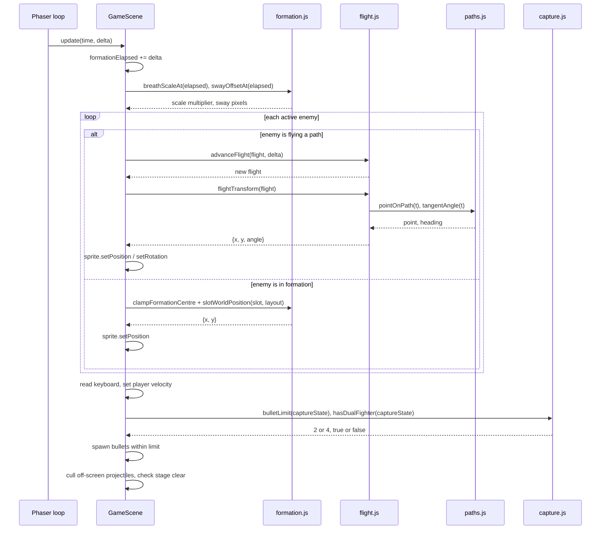
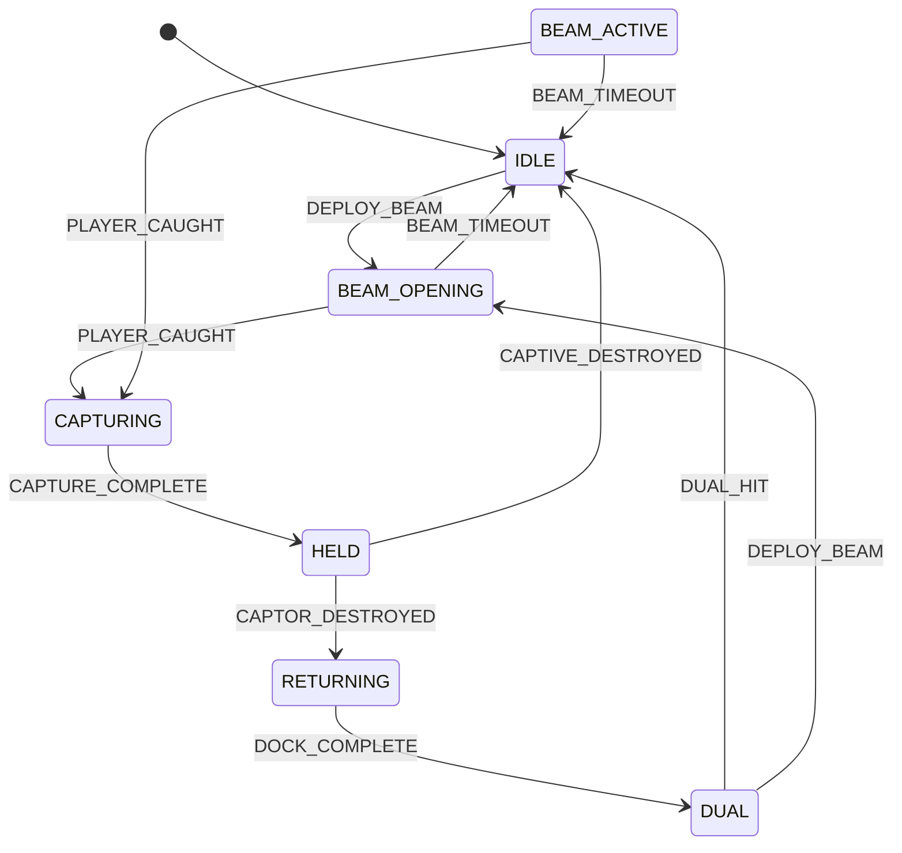

# Architecture

A technical companion to the [README](../README.md). This covers the module boundary and why it is drawn where it is, how a single frame flows through the codebase, how formation placement and the path bytecode interpreter work, and what the testing strategy covers and deliberately does not.

## The layering

```mermaid
graph TD
    subgraph browser["Browser"]
        HTML["index.html<br/>classic script: lib/phaser.js<br/>module script: src/main.js"]
    end

    subgraph phaser["Phaser-aware layer"]
        MAIN["src/main.js<br/>game config, scene registration"]
        TITLE["TitleScene"]
        GAME["GameScene<br/>sprites, input, collisions, timers"]
        OVER["GameOverScene"]
        SVC["ServiceScene<br/>the DIP switch block"]
        ENT["src/entities/enemy.js<br/>sprite construction"]
    end

    subgraph pure["Pure layer - no Phaser import"]
        CFG["src/config.js<br/>tuning constants"]
        FORM["formation.js"]
        CARAVAN["caravans.js<br/>the 13 entrance rows"]
        PATHCODE["pathcode.js<br/>the bytecode interpreter"]
        PATHS["paths.js<br/>every path, as a byte program"]
        FLIGHT["flight.js"]
        DIFF["difficulty.js<br/>4 x 26 x 10 parameter table"]
        ATTACK["attack.js<br/>launch counters, no-fire"]
        STARS["starfield.js<br/>the 63-star LFSR field"]
        SCORE["scoring.js"]
        STAGE["stages.js"]
        CAP["capture.js"]
        PLAY["players.js<br/>two-player turns"]
        DIPS["dips.js<br/>the operator's switches"]
        DEMO["demo.js<br/>the attract pilot"]
        PERS["persistence.js"]
        STATS["stats.js"]
        AUDIO["audio.js<br/>which sound plays when"]
        ART["art/pixelArt.js<br/>every ship, as a pixel grid"]
        SYNTH["audio/synth.js + soundBank.js<br/>every sound, as a spec"]
    end

    subgraph tests["tests/ - vitest, headless"]
        T["22 test files, 491 tests"]
    end

    HTML --> MAIN
    MAIN --> TITLE
    MAIN --> GAME
    MAIN --> OVER
    MAIN --> SVC
    GAME --> ENT
    GAME --> CFG
    GAME --> FORM
    GAME --> PATHS
    GAME --> FLIGHT
    GAME --> SCORE
    GAME --> STAGE
    GAME --> CAP
    GAME --> PLAY
    GAME --> DEMO
    GAME --> PERS
    GAME --> STATS
    GAME --> AUDIO
    GAME --> SYNTH
    GAME --> ATTACK
    GAME --> STARS
    GAME --> DIPS
    TITLE --> PERS
    TITLE --> SYNTH
    TITLE --> STARS
    TITLE --> DIPS
    SVC --> DIPS
    OVER --> STATS
    FLIGHT --> PATHS
    PATHS --> PATHCODE
    SCORE --> FORM
    STAGE --> CARAVAN
    STAGE --> DIFF
    ATTACK --> DIFF
    FORM --> CARAVAN
    AUDIO --> SYNTH

    T --> FORM
    T --> PATHS
    T --> FLIGHT
    T --> SCORE
    T --> STAGE
    T --> CAP
    T --> PERS
    T --> STATS

    style pure fill:#eef7ee,stroke:#4a7c4a
    style phaser fill:#eef1f7,stroke:#4a5c7c
    style tests fill:#f7f3ea,stroke:#7c6a4a
```



The arrows only ever point downward out of the Phaser layer. Nothing in the pure layer reaches back up.

## The boundary rule

**No module under `src/systems/` may import Phaser, touch the DOM, read a global, or mutate anything it was handed.**

The rule is one line, and it is checkable in one command:

```bash
grep -r "Phaser\|phaser" src/systems/
```

The only hits are the words "Phaser" inside two comments explaining why the module exists instead of using Phaser's tween system.

### What the rule buys

The obvious payoff is testability, but that is a consequence rather than the point. The real property is that **the rules of the game have a definition that is independent of how they are drawn.** Three things follow:

1. **Tests need no harness.** No canvas, no jsdom game instance, no headless Chromium in CI. The workflow is `npm ci && npm run lint && npm test` on plain Node.
2. **Tests need no mocks.** This is the part that usually erodes. When logic lives inside a framework object, testing it means constructing a fake version of that object, and the fake drifts from the real one until the tests assert things about the fake. Here `scoreFor('boss', { diving: true, escorts: 2 })` takes plain values and returns a number. There is nothing to fake.
3. **The untested surface is small and deliberately boring.** Everything left in the scenes is sprite creation, collision registration, timer scheduling, and HUD text. That code is not tested, so it is kept to a shape where a reader can verify it by eye.

### Where dependencies are injected instead of imported

`persistence.js` is the clearest example. It never references `localStorage`; the storage object is a parameter.

```js
loadHighScore(storage, key)
saveHighScore(storage, score, key)
```

This started as a testability concern and turned out to matter in production. `localStorage` access throws outright in a sandboxed iframe or with site data blocked. `resolveStorage()` probes with a real write round trip rather than checking for the object's presence, because Safari in private mode historically exposed the object and threw on write. If the probe fails, the game gets an in-memory shim and quietly forgets the score instead of white-screening.

### Immutability in the hot path

The pure modules return new objects rather than mutating their arguments, including in code that runs every frame:

```js
export function advanceFlight(flight, deltaMs) {
  const elapsedMs = Math.min(flight.elapsedMs + Math.max(deltaMs, 0), flight.durationMs);
  return { ...flight, elapsedMs };
}
```

Forty small object allocations per frame is not a cost worth optimising against at this scale, and the return-a-new-value shape is what makes a test able to assert on a sequence of states rather than on a single mutated one.

## How a frame flows

`GameScene.update(_time, delta)` is deliberately short. It advances the starfield and then delegates:

```js
update(_time, delta) {
  if (this.isGameOver) return;

  this.updateStarfield(delta);
  this.formationElapsed += delta;

  this.updateFormation(delta);
  this.updateAttacks(delta);   // per-type launch counters; see attack.js
  this.updateDiveSound();
  this.updatePlayer();
  this.updateCaptive(delta);
  this.updateBeam(delta);
  this.cullProjectiles();
  this.checkStageComplete();
}
```



Three properties are worth calling out.

**Positions are derived, not accumulated.** An enemy sitting in formation has its position recomputed from its slot every frame:
`clampFormationCentre(...)` then `slotWorldPosition(slot, layout)`. Nothing integrates a velocity, so there is no drift, and forty sprites cannot desynchronise from each other. The original code moved sprites incrementally and needed an O(n^2) anti-overlap pass to correct the resulting drift. Deriving positions removes both the drift and the pass.

**Time is delta-driven, never per-frame-probability.** Both enemy fire and bomb release were originally rolled with `Math.random() < chance` once per enemy per frame, which tied difficulty to display refresh rate - the same stage was roughly twice as hard at 144Hz as at 60Hz. Attack launches now come from the per-type countdown counters in `attack.js`, decremented by the frame delta; a diver carries its continuous-bomb allowance from the difficulty row and releases from the aim band over the player's column with a fixed reload between shots. All of it is arithmetic on `delta`, so the behaviour is identical at any frame rate.

**Collisions are the one place the scene owns a rule.** `registerCollisions()` holds the guard that makes Challenging Stages safe:

```js
this.physics.add.overlap(this.player, this.enemies, (_player, enemy) => {
  if (this.challenging) return;
  ...
});
```

The arcade's bonus round routes enemies straight through the player's lane. Without this guard the bonus round would be the most lethal part of the game. It lives in the scene because it is a property of the Phaser collision registration rather than of the rules themselves.

## Formation and slot assignment

Galaga assembles exactly 40 enemies into a 10-column grid.

| Row | Type | Columns occupied | Count |
| --- | --- | --- | --- |
| 0 | Boss Galaga | 3-6 | 4 |
| 1 | Goei | 1-8 | 8 |
| 2 | Goei | 1-8 | 8 |
| 3 | Zako | 0-9 | 10 |
| 4 | Zako | 0-9 | 10 |

Listing the occupied columns per row, rather than a width and an offset, is what keeps the shorter boss and goei rows centred against the full-width zako rows without any per-row arithmetic at the call site.

`buildFormationSlots()` returns those 40 slots in **grid space**, not world space:

```js
{ index, row, column, type, gridX: column - centreColumn, gridY: row }
```

`gridX` is offset so the grid centre (column 4.5) maps to 0. That single normalisation is what makes world placement a multiply-and-add around a centre point, and it is what makes breathing free:

```js
x = centreX + gridX * spacingX * breathScale + swayX
y = topY   + gridY * spacingY
```

Breathing scales the **horizontal** offset only. Vertical spacing is fixed, so rows can never collide as the formation expands. `breathScaleAt()` and `swayOffsetAt()` are both pure sine functions of elapsed milliseconds - given the same elapsed time they return the same value, which is why a test can assert the phase behaviour without stepping a game loop.

`clampFormationCentre()` keeps the outermost column on screen. It has to account for the current breath scale, because the formation is widest at peak inhale:

```js
halfWidth = ((FORMATION_COLUMNS - 1) / 2) * spacingX * breathScale
```

and it centres rather than returning an inverted range on a screen too narrow to hold the grid.

**Slot assignment** happens at stage start. `launchFormation()` decodes the stage's caravan row into five flights of eight (`buildEntryGroups` in `formation.js`), and every member arrives carrying which of the 22 fly-in blocks it flies, whether the block is mirrored, and the launch beat it goes on. The enemy carries its `slot` for the rest of its life: a diver that survives its run flies a `returnPath` computed from that same slot and settles back into it.

## The path bytecode interpreter

Galaga's enemies are not driven by curves. The ROM stores each flight shape as a *path block* - byte pairs of `[signed turn delta, frame count]` behind a terminator, 256 heading units to the circle - and an interpreter turns the ship by the delta and advances it at its speed once per frame. `src/systems/pathcode.js` is that interpreter; the cubic Bezier chains earlier revisions flew are gone.

```js
// One interpreter frame: turn, then advance.
state.heading += turn;
const direction = headingToVector(state.heading);   // 0 up, 64 right, 128 down
state.x += direction.x * state.speed;
state.y += direction.y * state.speed;
```

Programs are compiled to a **track** - one sampled point per arcade frame at 60.606 Hz - rather than run live against sprites, so the rest of the game keeps its pure `pointOnPath(track, t)` interface and the interpreter stays testable without a clock. Linear interpolation between two adjacent samples is exactly what the cabinet shows between two adjacent frames.

Flights have the ROM's two-phase structure: the path block flies the authored shape, and when it runs out the ship steers onto its destination with a clamped turn rate (`compileHoming`). A target that falls inside the turning circle can never be reached by steering toward it - greedy pursuit orbits it forever - so the homing phase steers *away* until the target is outside the circle, then comes around. Entry flights home onto their formation slot; dives home onto an exit point below the screen aimed at where the player was when the run launched - committed, not tracking, which is what makes dodging a dive a matter of reading it early.

### The path families

| Generator | Data behind it | Terminates |
| --- | --- | --- |
| `entryPath(variant, target, screen, mirrored)` | 22 authored fly-in blocks - the ROM's own count - each mirrorable about the centre line by the caravan byte's bit 6 | Exactly at the formation slot |
| `divePath(origin, playerX, screen, {enemyType, stageIndex})` | A family of eight dive blocks, selected by 26 rows of per-stage flight vectors, one column per enemy type, with per-row speed | Off the bottom of the screen |
| `returnPath(target, screen)` | A short drop program plus homing, on the side nearest the slot | Exactly at the formation slot |
| `challengingPath(pattern, offset, screen)` | Eight preset route programs; no homing phase at all - the whole route is the block | Off screen; never in a slot |

`ENTRY_FLOOR_FRACTION = 0.62` is a constant with a bug behind it, documented in the source. An earlier revision looped entry paths through `height * 0.95`, which routed all forty arriving enemies through the player's row and ended the game during the opening stream before a shot could be fired. The test `entry flights > never descends into the lane the player occupies` in `tests/paths.test.js` pins the invariant for all 22 blocks on both sides, so the data cannot silently drift back.

## Capture as a state machine

The tractor beam cycle is the one piece of state where the original implementation's shape was actively wrong. It used four independent booleans, which meant the type could represent states that should not exist - captured and docked simultaneously.



`transition(state, event)` is a total function over an explicit table. Two properties make it safe to drive from a scene full of Phaser timers:

- `RESET` always returns `IDLE`, because a new life or a new stage clears any capture in flight.
- Any other event with no transition from the current state returns the state **unchanged**. A stray timer callback firing after a stage has already ended cannot corrupt the machine.

The two branches out of `HELD` are the mechanic. Destroy the captor and the ship returns. Shoot your own captive and it is gone for good. Distinguishing those is exactly what four loose booleans could not do cleanly.

`bulletLimit(state)` also lives here rather than in the input handler. The two-bullet limit (four while dual) is the core constraint of Galaga's feel, and it is a consequence of capture state, so it belongs with the capture rules.

## Testing strategy

```bash
npm test        # vitest run
npm run lint    # eslint .
```

491 tests across 22 files, one per pure module. Roughly:

| File | Tests | Focus |
| --- | --- | --- |
| `tests/stages.test.js` | 67 | Challenging-stage cadence, the difficulty table read-through, the four ranks, entrance rows, the transform cycle, flag denominations, the 255 rollover |
| `tests/persistence.test.js` | 51 | The BEST 5 board and the stored difficulty rank: ranking, ties, insertion, initials, corrupt values, missing keys, throwing storage, memory fallback |
| `tests/formation.test.js` | 32 | Slot counts and types, grid-to-world placement, breathing phase, centre clamping, entry-flight grouping and launch beats |
| `tests/paths.test.js` | 30 | Track evaluation, all 22 fly-in blocks on both sides, the dive family and its flight vectors, the entry-floor invariant, the eight challenging routes |
| `tests/capture.test.js` | 29 | State transitions, ignored events, reset, bullet limit, the rescue rule, whether a captive may bomb |
| `tests/pixelArt.test.js` | 29 | Grid parsing, ship sizes, centre-line symmetry, distinct silhouettes, recolours that stay pixel-identical |
| `tests/synth.test.js` | 28 | Waveforms, envelopes, note names, exponential glides, a deterministic noise source, and that nothing renders outside [-1, 1] |
| `tests/scoring.test.js` | 27 | Formation vs diving values, boss escort multipliers, transform sets, the bonus-fighter schemes |
| `tests/soundBank.test.js` | 24 | Every sound audible and distinct, the per-rank cries, the boss survived-vs-died pair, the two looping sounds rejoining without a click |
| `tests/caravans.test.js` | 20 | The path-byte encoding, the 13 caravan rows, the arcade's stage-1 row byte for byte, the rank-indexed selector |
| `tests/players.test.js` | 17 | Two-player turns: whose ship, whose score, retiring one player while the other flies on |
| `tests/demo.test.js` | 17 | The attract pilot: aiming, dodging bombs, leaving an open beam, not chasing across the field |
| `tests/localArt.test.js` | 17 | Manifest parsing for local sprite overrides, and the damaged-boss tint |
| `tests/attack.test.js` | 15 | Per-type launch counters, the active-bomber ceiling and ramp, the transform pull, the no-fire bug's trigger conditions |
| `tests/audio.test.js` | 14 | Per-rank death sounds, the alternating gun, and that no audio file is ever committed to the repository |
| `tests/dips.test.js` | 13 | The switch block's defaults, round-trip and validation, the bonus columns, the coin box |
| `tests/pathcode.test.js` | 12 | The interpreter: decoding, straight runs, full circles, homing with the turn clamp and the unreachable-target escape, mirroring |
| `tests/difficulty.test.js` | 11 | The 4 x 26 x 10 table's shape, monotonicity in both dimensions, the stage-8 reload switch, the stage-1 enable flags |
| `tests/flight.test.js` | 11 | Delta accumulation, clamping at completion, transform output |
| `tests/starfield.test.js` | 11 | The LFSR's period, 63 stars a set, blink alternation, scroll wrap, stop and reverse |
| `tests/localAudio.test.js` | 9 | Manifest parsing for local sound overrides: unknown names, non-filenames, path traversal |
| `tests/stats.test.js` | 7 | Ratio math, zero-shot case, formatting |

### What is covered

Rules, boundaries, and the specific invariants that had already been violated once. Several tests exist because a defect existed first - the entry floor, the extra-life threshold sequence, the `t === 1` endpoint - which is the shape a regression suite is supposed to have.

Test style follows the modules: plain values in, assertions on returned values. No `beforeEach` building a fake scene, no spies, no module mocks. `tests/persistence.test.js` is the only file that constructs anything resembling a double, and it uses the real `createMemoryStorage()` exported from the module under test rather than a hand-rolled fake.

### What is not covered, and why

**Phaser rendering.** Asserting that a sprite drew at a given pixel needs a browser harness, a canvas, and a screenshot baseline. That machinery would test Phaser, not this project, and it would need maintaining every time an asset changed. The value in this codebase is in the rules, so the rules are what is covered.

The artwork is the interesting exception. Because every ship is a pixel grid in `src/art/pixelArt.js` rather than a PNG, the things that actually go wrong with hand-edited sprites are testable without a canvas: `tests/pixelArt.test.js` asserts each ship is symmetric about its centre line, that the four ranks have four different silhouettes, and that a recolour such as the damaged Boss Galaga is pixel-identical to the ship it recolours. What is untested is only the final step, `src/art/textures.js`, which is the one place a grid meets Phaser.

The audio is the same exception for the same reason. Because every sound is a spec in `src/audio/soundBank.js` rather than an mp3, the whole bank can be listened to under Node: `tests/soundBank.test.js` renders all 28 and asserts each is audible, that no two are identical, that the boss's survived-a-hit sound differs from its death, and that the two looping sounds rejoin their own start without a click. Pitch is checked by counting zero crossings, which needs no transform and no browser. What is untested is only `installSoundBank`'s single call into `AudioContext.createBuffer`, and even that is exercised against a stub.

**The scenes themselves.** They are untested by design, which is precisely why the boundary is enforced: the smaller the orchestration layer, the less that untested surface matters. Scene methods are kept to sprite construction, collision registration, timer scheduling, and HUD text. When a scene method starts to contain a rule, that rule belongs in `src/systems/`.

**The trade is explicit rather than accidental.** A rendering bug can ship here. A scoring bug, a stage-cadence bug, or a capture state bug cannot ship without a red build.

### CI

[`.github/workflows/ci.yml`](../.github/workflows/ci.yml) runs on push and pull request against `main`: checkout, Node 20 with npm cache, `npm ci`, `npm run lint`, `npm test`. No browser, no build step, no artifacts.

There is no build step in this project at all, which is itself a deliberate choice. GitHub Pages serves the repository root unchanged and Phaser is vendored in `lib/` rather than pulled from a CDN, so what CI checks, what runs locally, and what runs on the live demo are the same files.
